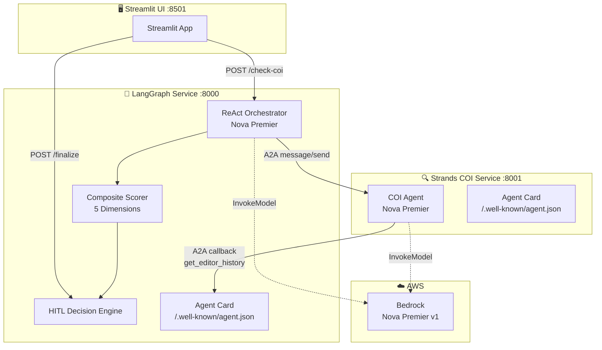
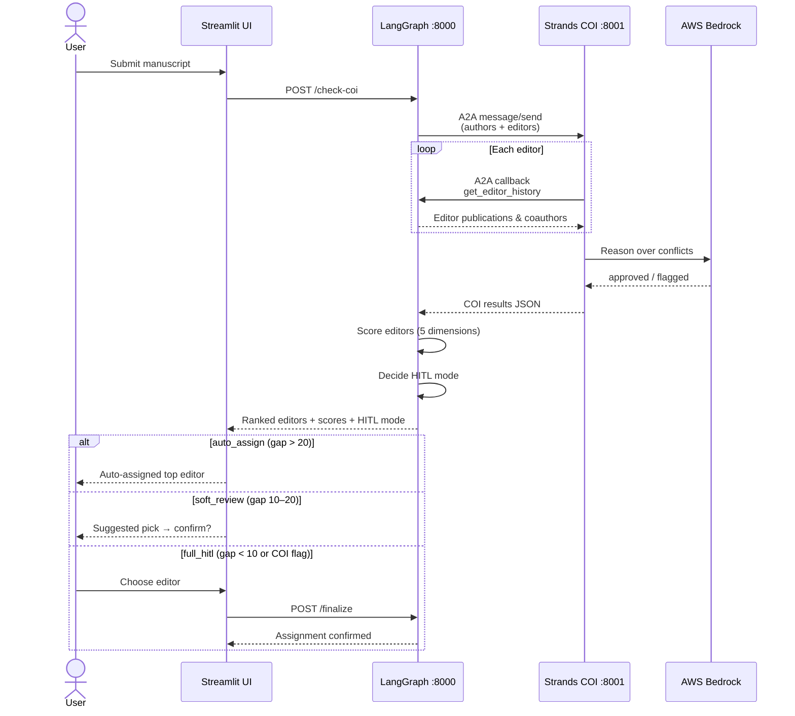
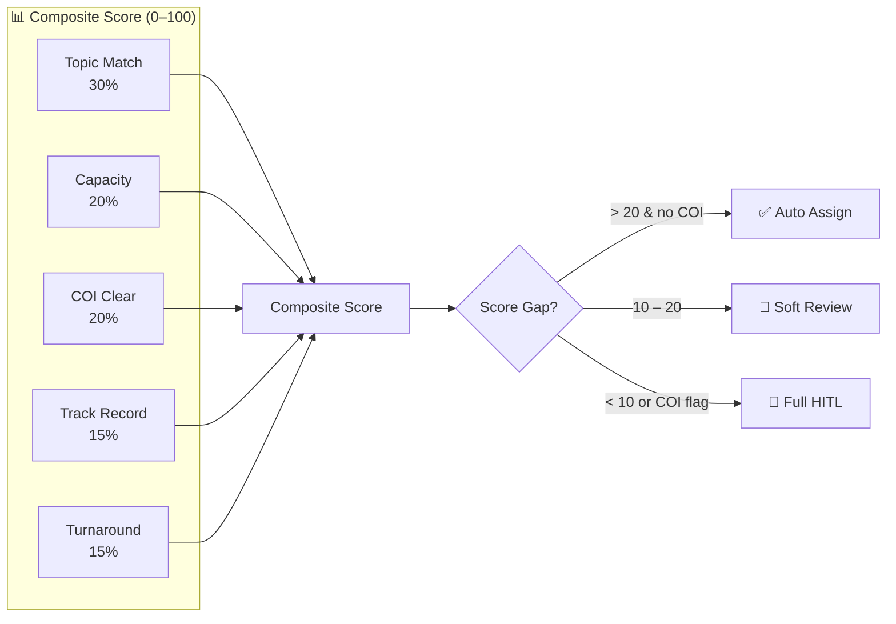
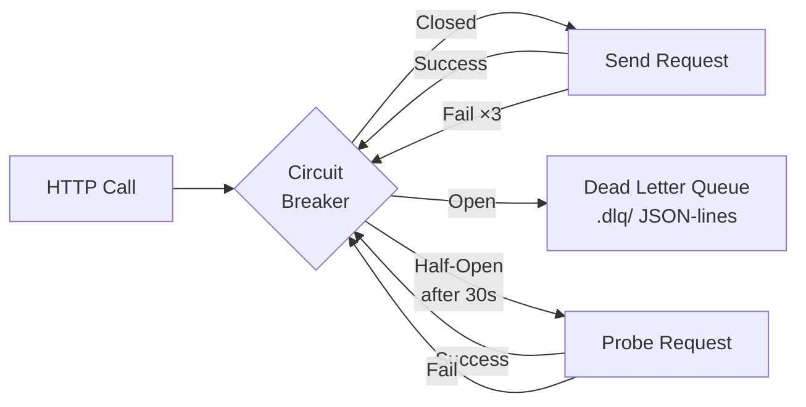

# at-ai-editor-recommender-l3

L3 Multi-Agent POC for automated peer-review editor assignment.  
Two AI agents collaborate via the **A2A protocol** with **Human-in-the-Loop** oversight.

---

## Architecture



---

## Workflow



---

## Scoring & HITL



---

## Resilience



Both inter-service calls (LangGraph → Strands, Strands → LangGraph) are protected by circuit breakers with DLQ fallback.

---

## Services

| Service | Port | Image |
|---------|------|-------|
| LangGraph Orchestrator | 8000 | `ghcr.io/acspubsedsg/at-ai-editor-recommender-langgraph` |
| Strands COI Checker | 8001 | `ghcr.io/acspubsedsg/at-ai-editor-recommender-strands-coi` |
| Streamlit UI | 8501 | — (local only) |

---

## Quick Start

```powershell
# One-click launcher (starts all 3 services in mock mode)
.\start.ps1
```

Or manually:

```bash
# Terminal 1 — Strands COI
PYTHONPATH=. MOCK_COI=true python strands_service/server.py

# Terminal 2 — LangGraph
PYTHONPATH=. MOCK_REACT=true python langgraph_service/callback_server.py

# Terminal 3 — Streamlit
streamlit run streamlit_app.py --server.port 8501
```

Agent Cards:
- http://localhost:8000/.well-known/agent.json
- http://localhost:8001/.well-known/agent.json

---

## Mock vs Live

| Env Var | Effect |
|---------|--------|
| `MOCK_COI=true` | Strands uses rule-based COI (no Bedrock) |
| `MOCK_REACT=true` | LangGraph uses deterministic mock (no Bedrock) |
| *(both unset)* | Full Bedrock inference via IRSA |

A2A calls between services are **always real HTTP** regardless of mock mode.

---

## Tests

```bash
pytest          # full suite (187 tests, ~4s)
pytest -v -k test_scoring   # specific file
```

| Test File | Tests | Covers |
|-----------|-------|--------|
| `test_callback_server.py` | 39 | Routes, A2A, agent card, editor utils |
| `test_coi_agent.py` | 24 | COI agent, Strands card, health |
| `test_resilience.py` | 46 | Circuit breaker, DLQ, transient errors |
| `test_scoring.py` | 45 | All 5 scoring dimensions, HITL thresholds |
| `test_fake_data.py` | 20 | Data integrity |
| `test_streamlit_app.py` | 13 | UI helpers |

---

## Test Data

**Manuscript MS-999** — *"Deep learning approaches for early detection of immunotherapy resistance"*  
Authors: John Smith, Jane Doe, Robert Chen

| Editor | COI | Reason |
|--------|-----|--------|
| Dr. Emily Jones | ⚠️ Flagged | Co-authored with John Smith (Nature Medicine 2023) |
| Dr. Kevin Lee | ✅ Approved | No overlap |
| Dr. Maria Smith | ✅ Approved | No overlap |

---

## Deploy to EKS

```bash
# IRSA service account (once)
kubectl apply -f k8s/dev/er-bedrock-sa.yaml --context eks-dev-real -n er

# Deploy services
kubectl apply -f k8s/dev/langgraph-service/ --context eks-dev-real -n er
kubectl apply -f k8s/dev/strands-coi-service/ --context eks-dev-real -n er
```

In-cluster DNS:
- `http://langgraph-svc.er.svc.cluster.local:8000`
- `http://strands-coi-svc.er.svc.cluster.local:8001`

---

## Repo Structure

```
├── fake_data.py                    # Test data (MS-999, 3 editors)
├── resilience.py                   # Circuit breaker + DLQ
├── streamlit_app.py                # Streamlit HITL UI
├── start.ps1                       # One-click launcher
├── pyproject.toml                  # Dependencies & version
│
├── langgraph_service/              # Orchestrator — :8000
│   ├── callback_server.py          #   Entry point (Starlette)
│   ├── agent_card.py               #   A2A Agent Card
│   ├── a2a_handler.py              #   A2A executor + legacy adapter
│   ├── routes.py                   #   REST endpoints
│   ├── editor_utils.py             #   Name parsing & reasoning helpers
│   ├── scoring.py                  #   5-dimension scoring + HITL
│   └── Dockerfile
│
├── strands_service/                # COI Checker — :8001
│   ├── server.py                   #   Entry point (Starlette)
│   ├── agent_card.py               #   A2A Agent Card
│   ├── a2a_handler.py              #   A2A executor + legacy adapter
│   ├── coi_agent.py                #   Strands agent (Bedrock / mock)
│   └── Dockerfile
│
├── tests/                          # 187 unit tests
│
├── k8s/dev/                        # EKS manifests
│
└── .github/workflows/              # Docker build CI
    ├── docker-langgraph.yaml
    └── docker-strands.yaml
```
