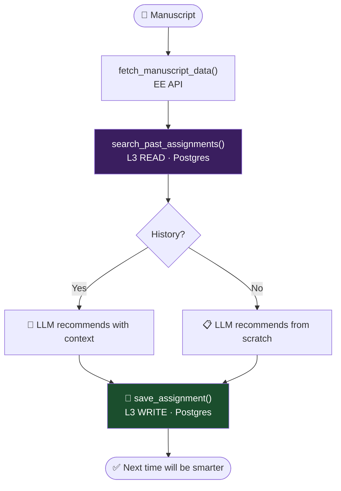
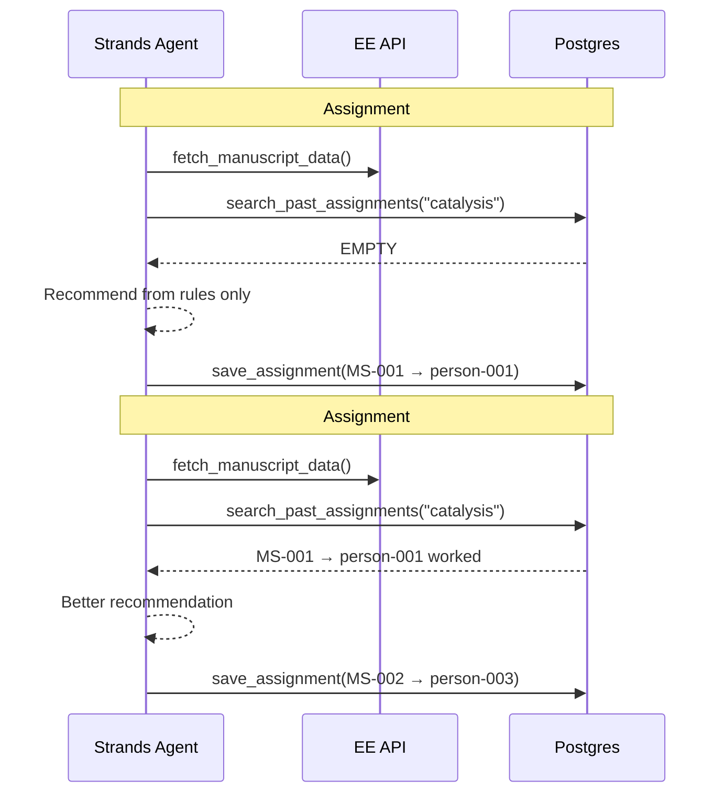

# Memory POC — Editor Assignment with L3 Learning

Editor assignment agent that **learns from past assignments**.  
Each recommendation is saved to Postgres → next similar manuscript gets a smarter pick.

## How It Works



## Learning Loop



## Files

| File | What |
|------|------|
| `memory.py` | L3 store: save, search, format for prompt |
| `agent.py` | Strands agent with 2 tools + mock mode |
| `app.py` | FastAPI: `/execute_workflow`, `/health` |
| `tests/test_memory.py` | 12 tests, no Docker/AWS needed |

## Run Tests

```bash
cd memory-poc
pytest tests/ -v
```

## Memory Tiers

| Tier | What | Backend |
|------|------|---------|
| L2 | Session checkpoint (crash recovery) | MemorySaver / S3 |
| L3 | Past assignments (learning) | Postgres |

## What L3 Stores

```json
{
  "editor_person_id": "person-001",
  "reasoning": "Expert in catalysis, lowest rank, no COI",
  "runner_up": "person-002",
  "journal_id": "JACS",
  "manuscript_number": "MS-001",
  "timestamp": "2026-03-31T10:00:00Z"
}
```

