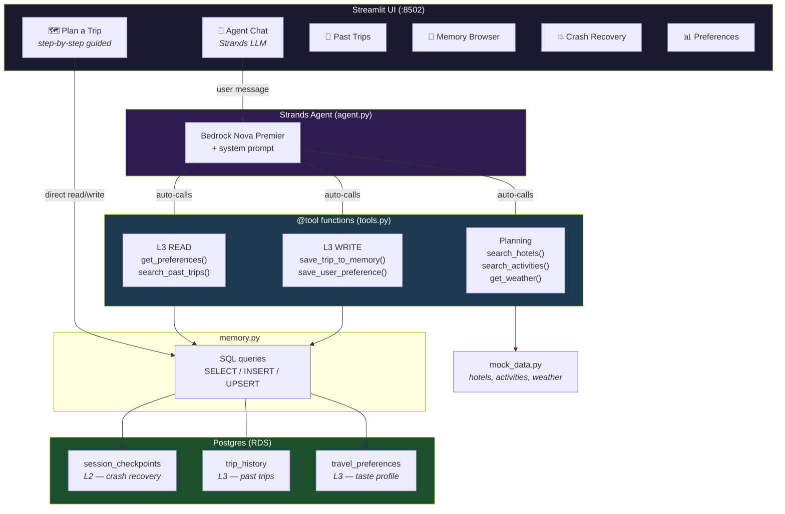
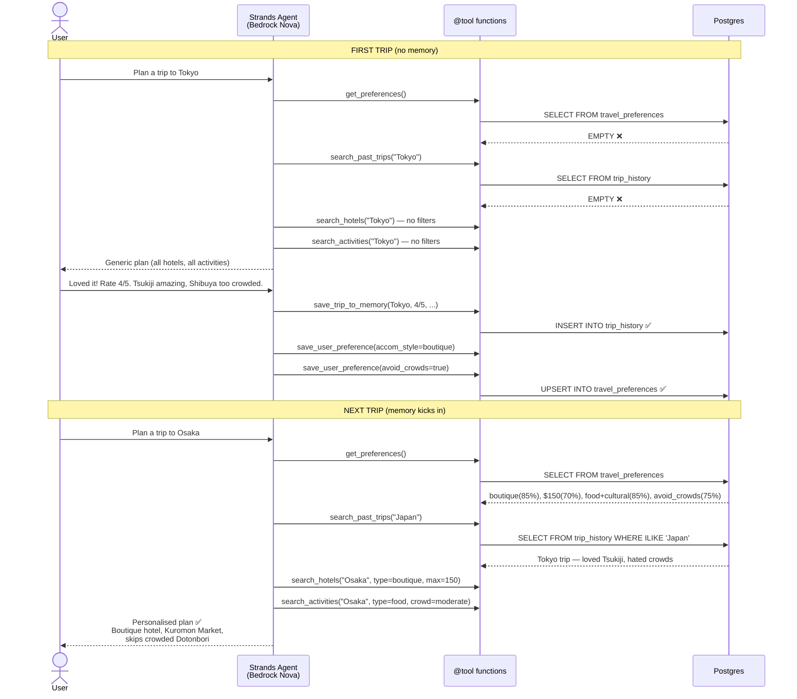
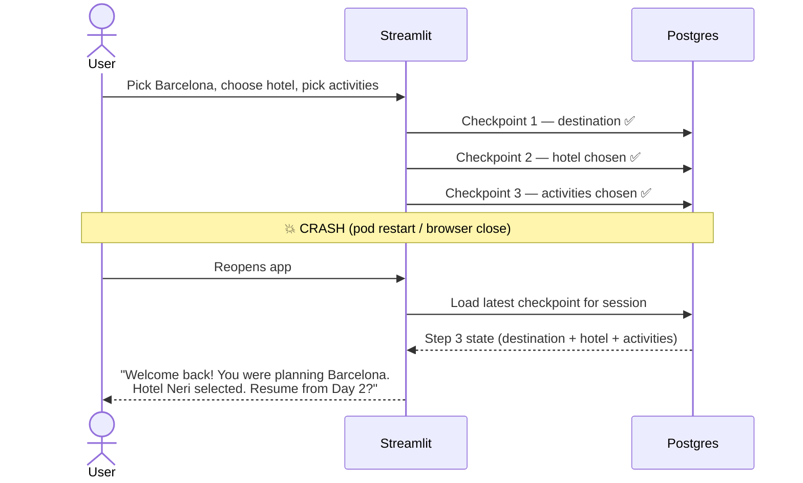

# 🌍 Travel Planner Memory POC

**Strands Agent + Postgres** — L2 (Session) + L3 (Long-term) memory.

## Architecture



## Agent Flow — How Memory Makes Decisions Better



## L2 Crash Recovery Flow



## Quick Start

```powershell
pip install strands-agents strands-agents-bedrock psycopg2-binary streamlit python-dotenv
.\start.ps1 --seed
```

## Files

| File | Purpose |
|------|---------|
| `agent.py` | Strands Agent — Bedrock Nova + system prompt |
| `tools.py` | 7 `@tool` functions (memory read/write + hotels/activities/weather) |
| `memory.py` | L2 checkpoint + L3 trip/preference read/write |
| `mock_data.py` | Mock data for 8 cities |
| `db.py` | Postgres connection, DDL, `seed_demo_data()` |
| `streamlit_app.py` | 6-tab UI |

## UI Tabs

| Tab | What |
|-----|------|
| 🗺️ Plan a Trip | Step-by-step guided planner (side-by-side WITH/WITHOUT memory) |
| 🤖 Agent Chat | **Strands LLM** — chat with the agent, it calls tools autonomously |
| 📜 Past Trips | Browse L3 trip_history |
| 🧠 Memory Browser | Raw Postgres tables |
| 💥 Crash Recovery | L2 session checkpoint demo |
| 📊 Preferences | L3 preference dashboard |
